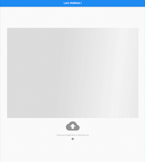

※勉強用レポジトリのため，コードの書き方が雑な可能性あり  

# できること  

画像をインプットすると，その画像を表示してくれます．  



## 必要なソフト  
1. Docker  
2. Docker Compose (Linuxの場合は別途インストールが必要．Windows・Macの場合はDocker Desktopに含まれている)  
3. Flutter  (Dockerを使う場合は不要)  
※1,2のセット，もしくは3のみで動作します．  

## 初回のみに必要な作業  
### Dockerを使う場合  
docker-compose.yamlと同じディレクトリに`.env`を作成し，以下のように記述してください．
```
PORT=8080
LC_ALL=en_US.UTF-8
```  
また，Dockerのインストールも必要です．  

### Flutterを使う場合
特になし．  

## 通常の起動方法  
### Dockerを使う場合  
`docker-compose up --build`  
(あらかじめDockerをインストールしておく必要があります)  
→ ブラウザで以下のURLにアクセス  
127.0.0.1:8080  

### Flutterを使う場合
```bash
cd app
server/server.sh
```
→ ブラウザで以下のURLにアクセス  
127.0.0.1:8080  

## 備忘録
### 私が初めに試したこと  
`flutter create app`  

### 私がコードを書いたところ  
`lib/main.dart`のみ  

### もしうまくビルドできない場合  
`flutter clean`  

### flutterを動作させる上で不足がないかチェック  
`flutter doctor`  

### flutterのチャンネルを調べる  
`flutter channel`  

## 参考　　
[公式Doc](https://flutter.dev/docs/get-started)  
[【3.0対応】Flutter webをGithub PagesにデプロイするGithub Actions](https://zenn.dev/nekomimi_daimao/articles/26fd2e3b763191)  
[Containerizing Flutter web apps with Docker](https://blog.logrocket.com/containerizing-flutter-web-apps-with-docker/)  
[Flutter クロスプラットフォーム向け画像アップロード](https://www.grow-tag.com/flutter/flutter-picture-upload/)  
[[Flutter]コピペで使える！ボタンのデザイン16種類をまとめました](https://qiita.com/coka__01/items/30716f42e4a909334c9f)  
[flutter_dropzone 3.0.5](https://pub.dev/packages/flutter_dropzone)  
[【Dart】イメージライブラリを使った画像処理](https://cbtdev.net/dart-image-library/)  
[How to Encode/Decode Path, File, Bytes and Base64 in Dart/Flutter](https://www.fluttercampus.com/guide/182/encode-decode-path-file-bytes-base64-in-dart-flutter/)  
[Flutter画像の表示方法と各形式の変換](https://qiita.com/ling350181/items/916ab3174c3e0dfadb00)  
[IconButton class](https://api.flutter.dev/flutter/material/IconButton-class.html)  
[Material Icons](https://fonts.google.com/icons?selected=Material+Icons)  
[When to use ‘?’, ‘!’ or ‘i’ icons in your UX](https://bootcamp.uxdesign.cc/when-to-use-and-i-in-your-ux-a2d63038a274)  
[Tooltip class](https://api.flutter.dev/flutter/material/Tooltip-class.html)  
[heic_to_jpg 0.2.0](https://pub.dev/packages/heic_to_jpg)  
[【Dart】【Flutter】論理演算子（AND・OR・NOT）の使い方](https://note.com/hatchoutschool/n/n1de5ae88bf58)  
[universal_platform](https://pub.dev/packages/universal_platform)  
[Flutter でデバイスの画面サイズを得る MediaQuery]()  
[](https://qiita.com/najeira/items/c98c5fec9c71104f8263)  
[【Flutter】Widgetをif・switch文で制御する方法](https://yumanoblog.com/flutter-if-switch/)  
[【Flutter】プログレスインジケーターの種類と全画面表示](https://cbtdev.net/flutter-progress-indicator/)  
[shimmer 2.0.0](https://pub.dev/packages/shimmer)  
[Create a shimmer loading effect](https://docs.flutter.dev/cookbook/effects/shimmer-loading)  
[【Flutter】Shimmerを利用してUXの高いローディング処理を実現](https://qiita.com/tetsukick/items/16b5f3bd68f094ec5e3d)  


